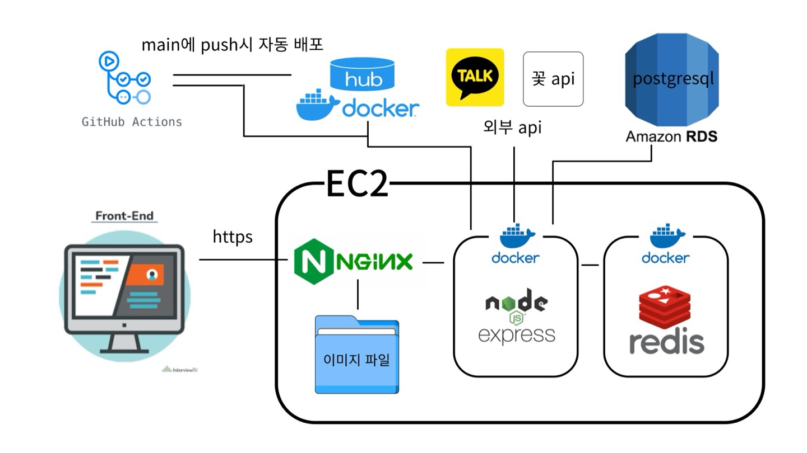
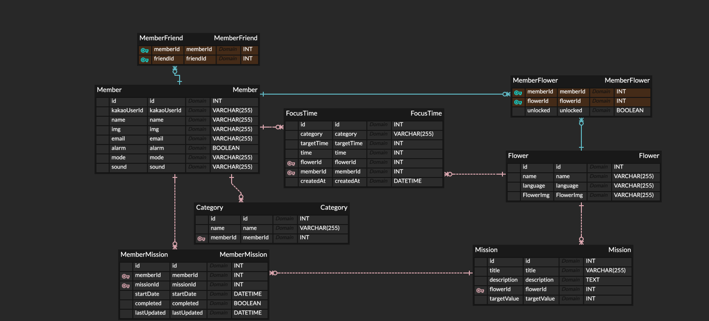

# 🌱 Garden

> **잠시 핸드폰을 내려놓고 현실의 중요한 일에 집중해야 할 때, Garden에서 꽃을 키워보세요!**  
> 사용자가 지정한 시간 또는 일정 시간 동안 웹에서 벗어나지 않으면 보상을 주어  
> 사용자의 사용 습관을 건강하게 관리해주는 서비스입니다.
---

## 📖 API 문서 (Swagger)
> **Garden API 문서는 Swagger를 통해 확인할 수 있습니다.**  
> 👉 [Garden API 문서 보기](https://garden-c.kro.kr/api-docs/)  
---

## 🤼‍♀️ DEVELOPER

| [이승찬](https://github.com/chan000518) | [민서](https://github.com/m2nsp) | [김홍엽](https://github.com/Yeobi00) | [조은수](https://github.com/ssikssikhan-cho) |
|--------|--------|--------|--------|
|  |  |  |  |
---

## 🌟 주요 기능 소개

### 👤 유저 & 친구 기능
- **카카오 로그인** 및 **카카오 프로필 연동**을 통해 간편하게 로그인할 수 있습니다.
- 친구 추가 기능을 통해 **친구의 집중 기록을 확인**하고, 랭킹 페이지에서 비교할 수 있습니다.

### ⏳ 집중 시간 관리
- 사용자가 직접 설정한 **타이머 기반 집중 시간** 또는 종료 전까지 실행되는 **스톱워치 모드** 지원.
- **SSE(Server-Sent Events) 연결**을 통해 특정 시간 동안 웹 서비스를 이용하지 않는지를 추적하여  
  페이지를 벗어나면 **집중 실패**로 처리합니다.
- 1/4주기로 클라이언트로 신호를 보내 꽃이 자라는 이미지를 변경합니다

### 🎯 미션 시스템
- 특정 행동을 수행해야 하는 **미션 기능** 제공.
- **미션 리스트 조회** 및 **남은 미션 진행 상황 확인** 가능.

### 📊 통계 제공
- 사용자의 집중 시간 데이터를 분석하여 **다양한 통계 정보** 제공.
- 자신의 집중 습관을 객관적으로 확인하고, 개선할 수 있도록 도와줍니다.

---

## 구현 세부 사항

## 1. 집중 시간 생성 및 관리 로직

### ✅ **이벤트 기반 집중 시간 관리 (Redis 활용)**
- 집중 시간이 생성되면 시간으로 Redis Sorted Set(`zAdd`)을 사용해 실행 예약
- `setInterval(1000ms)`을 이용해 1초마다 현재 시간으로 기준으로 이벤트 체크 후 실행
- 불필요한 주기적인 DB 업데이트 없이 집중 시간이 완료 시점에서만 DB 업데이트
- 집중시간 1/4마다 클라이언트로 이미지 변화를 넘겨주고 다음 1/4시간이 자날 떄 실행되게 Redis에 등록
- 타이머에 해당하는 시간이 모두 지나거나 클라이언트가 미 연결 시 집중시간을 알맞게 처리후 DB에 요청

### ✅ **실시간 데이터 전송 (SSE 기반)**
- 클라이언트는 SSE(Server-Sent Events)로 실시간 업데이트를 로그인한 계정 별로 수신
- 클라이언트가 연결이 끊겨도 재연결하면 최신 데이터 요청 가능
- 클라이언트의 로그인한 id를 중심으로 묶어 계정으로 관리하여 중복 접속을 처리
- 재 연결 시 현재 상황에 맞는 응답을 Redis에서 조회하여 전달

### 🛠 **서버에서 집중 시간을 관리하는 이유**
- 클라이언트에서 집중 시간을 직접 관리하면 로직이 복잡해질 가능성이 높음.
- 클라이언트의 예상치 못한 행동 (예: 같은 계정으로 중복 로그인, 브라우저 강제 종료)을 처리하기 위해 서버에서 집중 시간 관리.
- sse로 전달한 데이터를 띄우고 집중시간 생성, 종료만 클라이언트에서 실행하게 서버에서 관리하려고 함

### ✅ **레디스를 사용한 이유**
- 모든 집중시간을 `setInterval`로 관리하면 너무 많은 이벤트가 서버에 등록됨 
- 클라이언트의 조회와 이벤트 실행이 모두 데이터 베이스 요청으로 처리 시 부하가 커질 것 같다고 생각됨
- 이를 위해 레디스를 사용하여 레디스에 시간을 기준으로 이벤트를 등록하여 해당 시간이 되면 이벤트를 실행하게 함

### ✅ **SSE를 사용한 이유**
- 집중 시간 관리 및 조회를 위해 **서버와 클라이언트 간 주기적인 통신이 필요**했음.
- 처음에는 웹소켓(WebSocket)을 고려했으나, 양방향 통신이 필요하지 않다고 판단하여 SSE(Server-Sent Events)로 결정.
- SSE는 서버에서 특정 이벤트(집중 시간 관련)가 발생했을 때 클라이언트로 메시지를 전송하는 방식이라 더 효율적이라 생각됨.
- 비즈니스 로직상 프론트엔드가 서버에 주기적으로 요청을 보내는 방식보다, 서버가 필요한 시점에만 데이터를 전송하는 것이 적절하다고 판단.
- 이전 프로젝트에서 SSE를 사용해 사용자의 연결 상태를 관리한 경험이 있어 sse로도 사용자의 연결 여부를 체크할 수 있다고 생각했음
- 사용자 계정 기반으로 SSE 연결을 관리하여, 같은 계정으로 로그인한 모든 기기에서 동일한 데이터를 수신하는 구조임 
  (이 부분은 설계 의도는 아니었지만, 추가적인 성과)

### sse api과 생성api, 종료 api 3개의 api로 클라이언트가 더 쉽게 사용할 수 있도록 설계, DB 요청 최소화

---

## 🏗️ 시스템 아키텍처 (서버 구조)

### 🔍 시스템 구성 요소 설명

1️⃣ **Nginx (엔진엑스)**
   - **리버스 프록시 역할**: 클라이언트의 요청을 적절한 백엔드 서버로 전달
   - **정적 이미지 파일 제공**: 프론트엔드에서 필요한 정적 리소스(이미지 등)를 직접 서빙
   - **이미지 제공을 S3를 사용하지 않은 이유**: 이미지 개수가 적고, 자주 변경되지 않는 정적 이미지이기 때문에 비용 절감 및 서비스 단순화를 위해 자체 서버에서 제공

2️⃣ **PostgreSQL & AWS RDS**
   - **PostgreSQL**: 서비스의 주요 데이터를 저장하는 **관계형 데이터베이스(RDBMS)**
   - **AWS RDS**: PostgreSQL을 AWS의 관리형 서비스인 RDS에서 운영하여, 유지보수 부담을 줄이고 자동 백업 및 장애 복구 기능을 활용

3️⃣ **Redis (레디스)**
   - **데이터베이스 부하 감소**: 빈번하게 조회되는 데이터를 캐싱하여 DB 부하를 최소화합니다
   - **시간 순서 기반 이벤트 처리**: 집중 시간 타이머 및 일정 이벤트를 Redis Sorted Set을 사용해 빠르게 처리

4️⃣ **외부 API**
   - **카카오 API**: 로그인 및 사용자 정보를 받아오기 위해 사용합니다.
   - **정부 지원 꽃 API**: 정부에서 제공하는 꽃 데이터를 활용하여 서비스 내에서 꽃 정보를 제공합니다

5️⃣ **Docker (도커)**
   - **자동 배포 및 환경 일관성 유지**: 컨테이너 기반으로 서비스를 운영하여 서버 환경에 관계없이 안정적으로 배포 가능
   - **CI/CD 파이프라인과 연동**하여 변경 사항이 자동으로 배포되도록 설정

## 🛢️ ERD (데이터베이스 구조)

